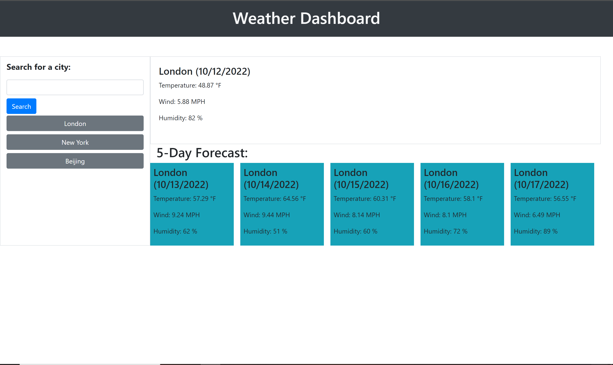

# Weather Dashboard

## Description

The goal of this project was to have a city enterd by the user and display the curretn weather and forecast.
This was done by using data from Third Party APIs to dispaly the wanted results.

## [Webpage](https://turtle2001.github.io/weather-dashboard/)


## Code Snippet
```JavaScript
fetch(coordinates)
        .then(response => response.json())
        .then(function (data) {
            var weather = 'https://api.openweathermap.org/data/2.5/forecast?lat=' + data[0].lat + '&lon=' + data[0].lon + '&units=imperial&appid=c5e9fba15567c9fdcf069c213871a2e5';

            fetch(weather)
                .then(response => response.json())
                .then(function (data) {
                    displayInfo(data);
                    addButton(data.city.name);
                })
        })
```
## Credit
Creators of Bootstrap and jQuery for their amazing tools
Also thanks to Moment.js

## Author Links
[LinkedIn](https://www.linkedin.com/in/alexis-zaragoza-5baa51242/)
[GitHub](https://github.com/turtle2001)
